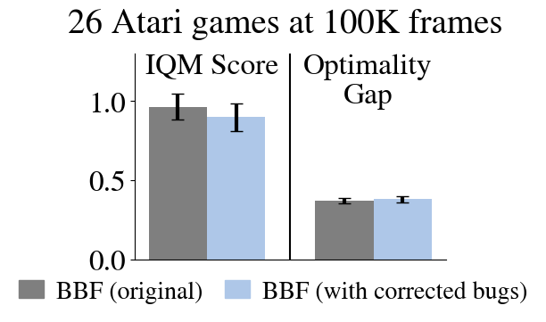
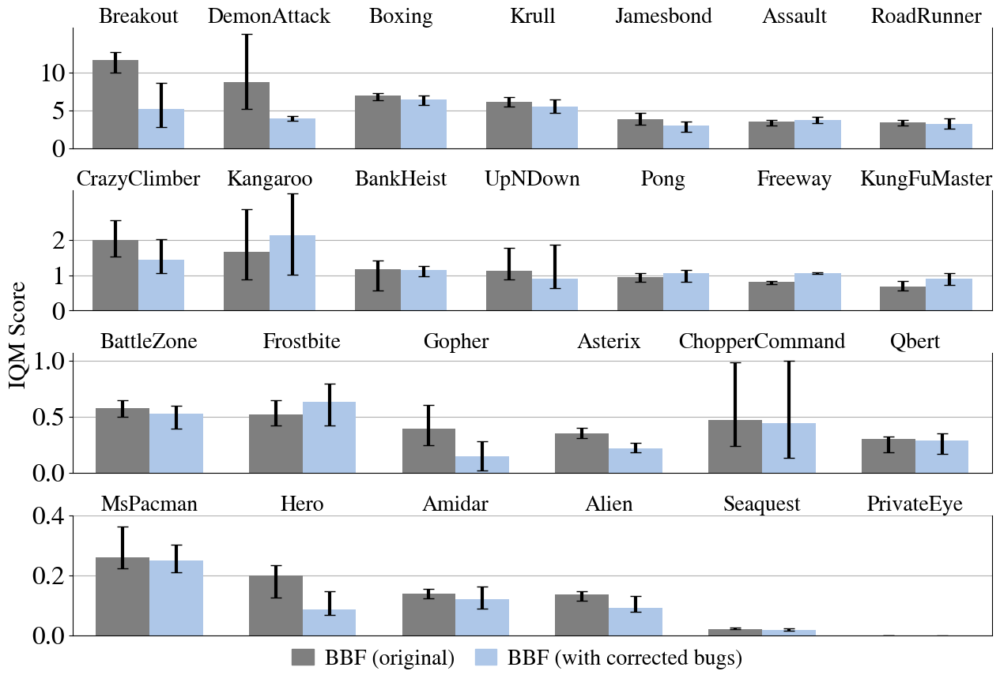

# Clean and efficient implementation of Bigger Better Faster (BBF)

Paper 👉[📄](https://arxiv.org/pdf/2305.19452) | Original code 👉[👨‍💻](https://github.com/google-research/google-research/tree/master/bigger_better_faster)

## User installation
```bash
python3 -m venv env
source env/bin/activate
pip install --upgrade pip setuptools wheel
pip install -e .[dev,gpu]
```
To verify the installation, run the tests as:```pytest```

You can train BBF on Breakout for 100k frames by launching:
```bash
launch_job/atari/launch.sh
```

## Performances
This code implements BBF with two bug corrections to the replay buffer compared to the original code. The trained agents reach comparable performances to the published version of BBF with a replay ratio of 2:

 
